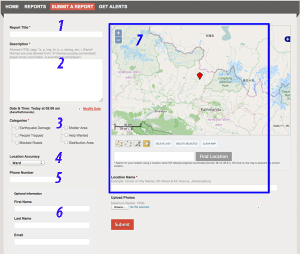
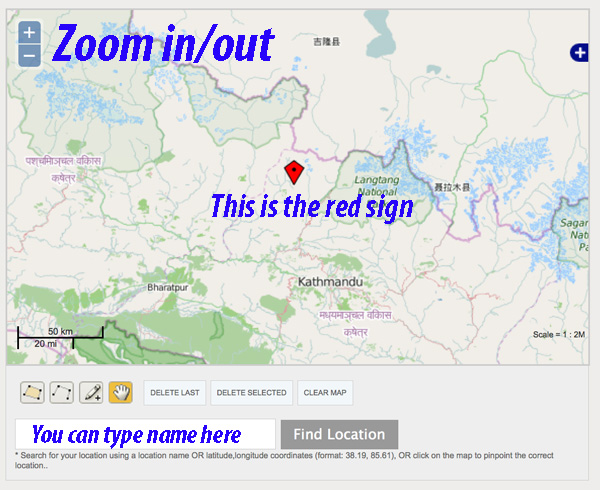
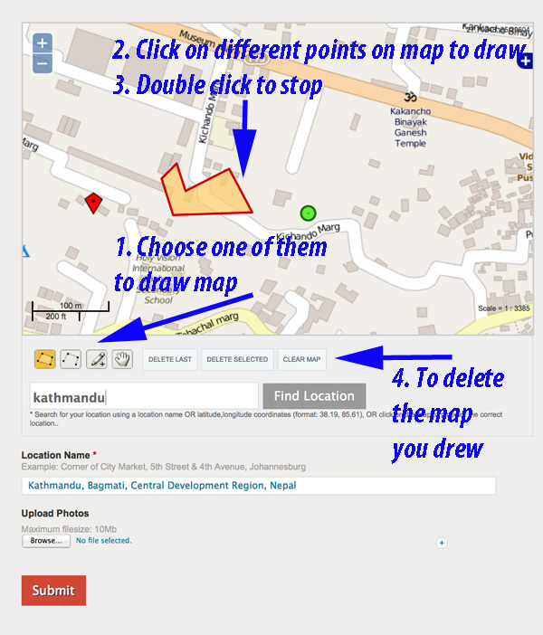

## Using quakemaps.org

Information is valuable if it can be used and found easily. We're using Ushahidi platform to manage information from different sources. This page describes how to use this platform and how you can help.

Our website is located at [quakemaps.org](quakemaps.org). To add a new information there, you have to "Submit Report". To see existing reports, you click on "Reports". Here's how you can do it

What kinds of report to submit?

* If you require new volunteers
* If you know volunteers who are free
* If you know somebody needs help
* If you know some place has been destroyed
* If you know some supplies are free
* If you know supplies are needed somewhere
* Any other news report from specific places

## Submitting a report

Go to the webpage [quakemaps.org](quakemaps.org) and click on "Submit A Report". Please see the pictures below on step by step help. The numbers on the picture and on the text below match each other. Please follow them step by step.

If something is not clear, please contact us. We're ready to help you.

1. Enter a Title, example "Volunteers needed for transporting medicine", or "A house destroyed near PlaceName"
1. Add description, example, what skills the volunteer has, how many people are needed, how much time the work will require, how many packets of medicine are required. Be as specific as possible, otherwise it will be difficult for others to help, and you may be wasting their time. But don't write a long description.
1. Choose a Category. People will be able to find your report by Categories. So, this is very important. Not choosing the right category will make your report hard to find, and will waste everybody's time
1. How sure are you about the location? Choose this in "Location Accuracy."
1. If you have a phone number that can be contacted for more information on your report, enter it
1. Enter your name and email
1. Enter the location in the map. Here's how to use this feature:
  * You can type the name of the place in this box and click on "Find Location". If the system recognizes your place, it will automatically fill in the box below and locate the place on the map above
  * You can use your mouse and drag the map to find your place. You can zoom in or our using + or - sign. The red sign points at the exact place you're trying to locate.
  * If you want to mark a larger area, use one of these tools. First pick a box, example the one on the left. Then click on the map, drag your mouse, click on other points. When you're done, double click. It will create a surface like you see on the picture. If you want to delete the last marking, or all markings, use the buttons on the right "Delete last", "Delete selected", etc.
1. If you have a picture, upload it
1. Submit the report

